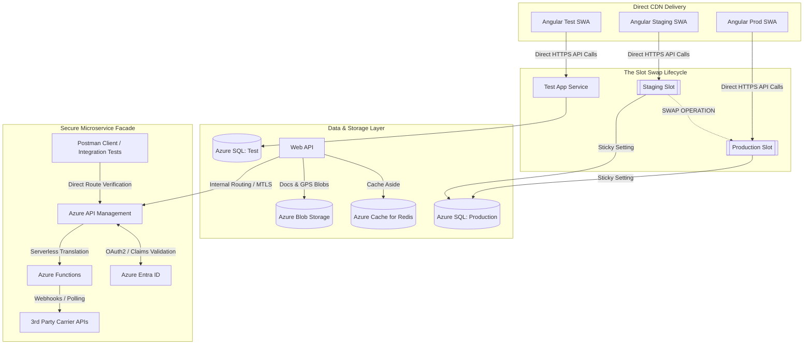
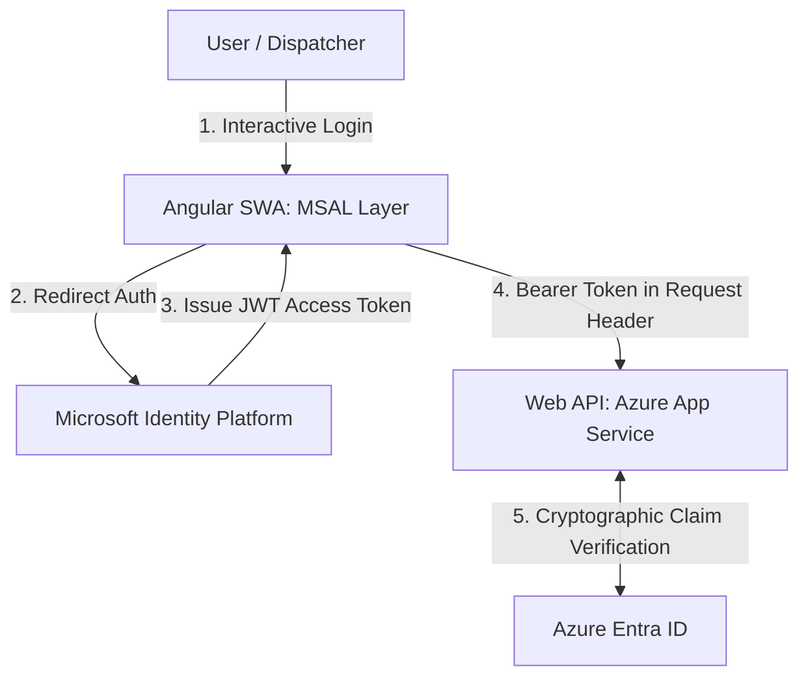

# Freight Logistics System Architecture

An enterprise cloud-native architecture for a mission-critical freight logistics web platform. This system decouples static client delivery from stateful compute layers, utilizes a strict 4-tier caching model to minimize database load, secures its application boundaries using MSAL with Microsoft login, and encapsulates external serverless microservices behind an internal API Management facade.

## 🚀 Architectural Pillars

* **Zero-Downtime Infrastructure:** Blue/Green style code promotions via Azure App Service Deployment Slots.
* **Enterprise Identity Federation:** Front-end access secured via MSAL (Microsoft Authentication Library) bound to Azure Entra ID RBAC profiles.
* **Strict State Isolation:** Unified physical environment boundaries for Test/Dev, with logical key-space isolation for shared caching tiers.
* **Cost-Controlled Compute:** A 3-tier hybrid route resolution pipeline designed to shield external computing budgets (Azure Maps API).
* **Decoupled Delivery Lifecycles:** Direct CDN asset publishing for front-end layers, fully isolated from backend binary modifications.
* **Optimized Data Lifecycles:** Horizontal date-range partitioning and rolling data retention to enforce strict budget caps on Azure SQL.

---

## 🗺️ System Topology

---

## 🔒 Enterprise Identity & Secure Token Flow (MSAL + Entra ID)

The application implements a zero-trust identity architecture mapping frontend presentation directly to backend compute capabilities:

### Authentication & Authorization Details
1. **Client-Side Guarding (Angular):** Routes within the Angular app are protected using native MSAL Guards. Unauthenticated users are automatically redirected to the organizational Microsoft sign-in page.
2. **The Interceptor Pattern:** An MSAL Interceptor maps your target backend API endpoints. It handles silent token acquisition and background token renewal, ensuring users are never interrupted during prolonged logistics dispatch sessions.
3. **API Perimeter Validation:** The .NET Web API extracts the claims array from the decrypted token payload to verify organizational tenant parameters and user-specific roles before allowing operations on core database or storage entities.

---

## 🛠️ Environmental Framework & Release Strategy

### 1. Frontend Promotion (Azure Static Web Apps)
The Angular application compiles against environment-specific profile variables (`environment.prod.ts`). Compiled assets are published **directly** to their respective environment containers. Front-end visual deployments are fully insulated from backend container recycling.

### 2. Backend Promotion (Azure App Service Slots)
The .NET Web API utilizes **Staging** and **Production** slots inside a unified App Service Plan.
* **The Warmup Pattern:** Code is published to the `Staging Slot`. Azure initiates local warm-up pings to spin up runtime worker threads before routing any live traffic.
* **The Swap:** A manual swap shifts traffic pointers instantly. If any edge failures are detected post-swap, an instant rollback is executed with zero downtime.

### 3. Database Schema Continuity (Azure SQL)
To prevent runtime exceptions during slot swaps, this repository mandates the **Expand and Contract (Parallel Change) Pattern**:
1. **Expand:** Schema migrations (adding nullable fields or new lookup tables) are executed manually on the Production Database *prior* to a swap.
2. **Swap:** The slot swap is executed. Both old and new API binaries simultaneously interact with the database safely.
3. **Contract:** Legacy fields/columns are removed after the environment completely stabilizes.

---

## 💾 Database Optimization & Lifecycle Management (Azure SQL)

To prevent unbounded database size growth and maintain rapid query performance as historical freight data accumulates, Azure SQL employs two lifecycle management strategies:

### 1. Horizontal Partitioning for Audit Trails
* **The Problem:** The `AuditLogs` table logs every structural change (e.g., dispatch modifications, user overrides, financial updates), causing it to grow by millions of rows rapidly.
* **The Solution:** The table is **partitioned by date ranges** (e.g., monthly chunks) utilizing Azure SQL Partition Functions and Schemes. 
* **The Benefit:** When a dispatcher requests an audit trail for a specific date range, the SQL engine executes **partition pruning**—completely ignoring irrelevant months. This keeps index sizes small, optimizes RAM usage, and maintains sub-second query execution times.

### 2. Time-Bounded Log Retention
* **The Problem:** System telemetry, application errors, and third-party API usage logs (`ApplicationLogs`) grow aggressively but lose their clinical value after a few months.
* **The Solution:** A **date-range retention period** (e.g., a rolling 90-day window) is strictly enforced. 
* **The Benefit:** An automated, low-priority cleanup process continuously purges records older than the retention boundary. This hard-caps the database file footprint, prevents data storage costs from spiraling, and ensures database backups and restoration times remain lean.

---

## ⚡ Data Volatility & Caching Lifecycle

The system enforces a **4-tier caching strategy** optimized around data longevity:

| Tier | Engine | Target Data Payload | Invalidation / Structural Strategy |
| :--- | :--- | :--- | :--- |
| **Tier 1** | `.NET ResponseCache` | Static System Lookups | Hard-capped local memory allocation; zero network I/O overhead. |
| **Tier 2** | `Azure Cache for Redis` | Dropdown Typeaheads | Shared instance isolated logically via key prefixing (`prod:typeahead:*` vs. `test:typeahead:*`). |
| **Tier 3** | Hybrid Cache-Aside / Blob | Multi-City Route GPS Coordinates | 24-hour `.NET ResponseCache` expiration backed by persistent JSON file writes on Azure Blob Storage. |
| **Tier 4** | `Azure Blob Storage` | Invoices / Bills of Lading | Cold, append-only document container storage. |

### Multi-City Route Resolution Fallback Flow
1. **Read Tier 1:** Check local `.NET ResponseCache` (Valid for 24 hours).
2. **Read Tier 2:** If missed, fetch the standardized object string from **Azure Blob Storage** based on a deterministic route waypoint hash naming convention (`route_[hash].json`). Re-populate Tier 1.
3. **Compute Tier 3:** If the file is not found, invoke **Azure Maps API**. Stream the resulting data payload back to the client, serialize it immediately to Blob Storage for subsequent runs, and warm up the cache layers.

---

## 🔒 Facade Security & Testability Blueprint

### Azure API Management (APIM) Positioning
Instead of facing the public internet, APIM is restricted to serving as an internal integration wall. 
* **Ingress Restriction:** Only authenticated requests from the primary Web API or authenticated testing infrastructure can cross the gateway boundary.
* **Token Hardening:** Entra ID issues strict Role-Based Access Control (RBAC) claims. APIM cryptographically validates these JWT signatures at the edge to shelter downstream Azure Functions from bad requests.

### Isolated Testing Engine (Postman)
Because APIM completely wraps all external third-party interactions, developers can validate microservice behaviors without firing up the Angular UI. Targeting APIM directly via **Postman** allows for the isolated testing of rate-limiting, error handling, webhook response mocking, and Entra ID scope parameters.
