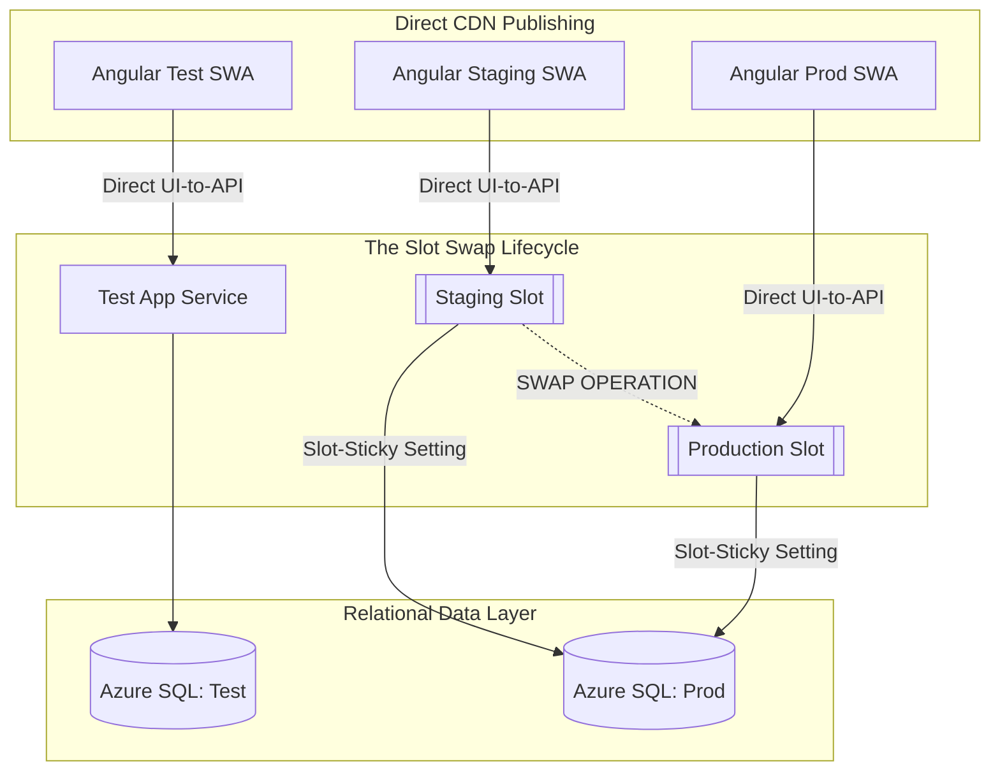
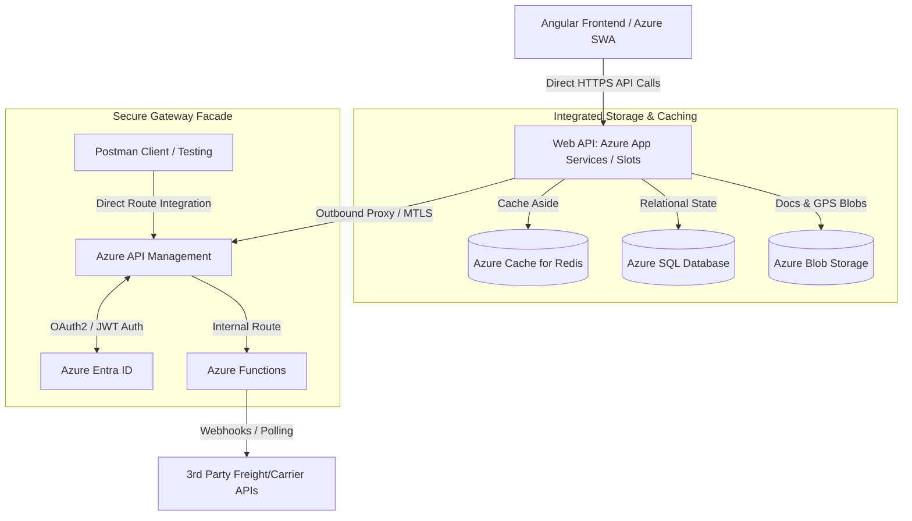
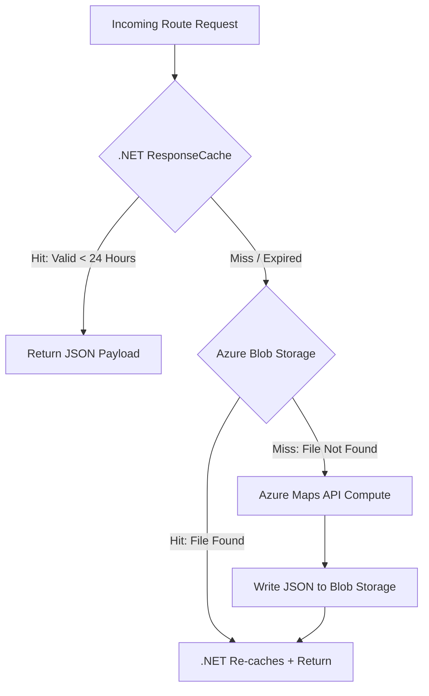

# Freight Logistics Architecture
### Integrated Cloud Infrastructure & Secure Microservice Gateways
**Technical Presentation**
DevOps Group Systems Defense

---

## 1. System Overview & Core Requirements

* **Domain:** Mission-critical freight logistics web application.
* **Core Technical Priorities:**
    * Decoupled frontend static asset delivery from stateful compute layers.
    * Zero-downtime backend execution via warm App Service deployment slots.
    * Isolated microservice gateway via APIM for third-party integrations and testing.
* **Hosting Model:** Fully managed, cloud-native Azure ecosystem.

---

## 2. Decoupled Multi-Environment Topology

---

## 3. Component Communication & Integration Architecture

---

## 4. Compute State & Schema Continuity

* **Frontend Delivery:** Angular static web assets are directly published to their respective Azure SWA instances. No slot switches are performed on the CDN edge.
* **Backend Zero-Downtime Swaps:** API code is published to the **Staging Slot** and fully warmed up by hitting the root runtime path prior to traffic routing redirection.
* **Database Drift Defense:** Employing an **Expand and Contract pattern**. Schema migrations are pushed *before* the slot swap occurs using backward-compatible, non-breaking mutations.

---

## 4b. Database Tuning & Cloud Cost Controls

To prevent unbounded data growth and optimize compute costs within Azure SQL, the relational layer implements two lifecycle architectures:

* **Horizontal Table Partitioning:**
    * High-volume `AuditLogs` are partitioned by **date ranges**.
    * Query engines leverage **partition pruning** to completely bypass irrelevant data blocks.
    * Result: Sub-second user access to historic compliance trails.
* **Time-Bounded Log Retention:**
    * System telemetry and API `UsageLogs` are capped on a rolling retention window.
    * An automated background process continuously purges aged records.
    * Result: Hard-caps database file size growth and flattens Azure storage expenses.

---

## 5. Comprehensive 4-Tier Caching Topology

To aggressively maximize performance, caching layers are partitioned by data change frequency:

| Tier | Caching Engine | Targeted Data Payload | Lifespan / Isolation Strategy |
| :--- | :--- | :--- | :--- |
| **Tier 1** | `.NET ResponseCache` | Long-term Static Lookups | Completely local in-memory; zero network hops. |
| **Tier 2** | `Azure Cache for Redis` | High-frequency Typeahead Search | Prefixed key spaces (`prod:typeahead:*`). |
| **Tier 3** | Hybrid Response/Blob | Multi-City Route GPS Data | 24-Hour cache fallback to JSON objects. |
| **Tier 4** | Azure Blob Storage | Historical Document Archive | Persisted behind authenticated API proxies. |

---

## 6. Tiered Route Resolution Pipeline

When a user requests multi-city route GPS coordinates, the Web API processes the request through a strict **3-tier failover lifecycle**:

---

## 7. Q&A and Engineering Appendix

* Open for peer review regarding schema management, token validation lifetimes, and caching boundaries.
* **Deep dives available in repository:**
    * Appendix A: System Component Trade-off Matrix
    * Appendix B: Dynamic Slot Swap & State Boundary Rules
    * Appendix C: Cache Key & Storage Lifecycle Strategy

---
